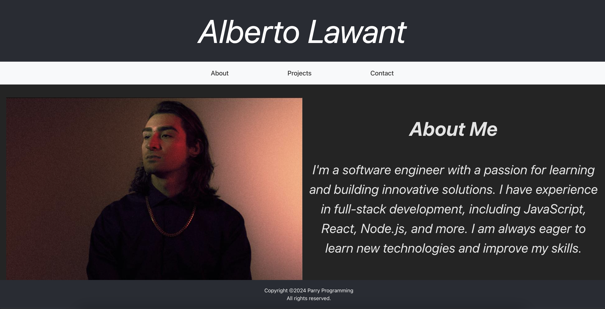

# React Portfolio



# Description

Welcome to my React portfolio! I was able to impletement most of what I learned this week at the bootcamp. Unfortunetly I was short on time to submit it, it's still a work in progress. I'm looking forward to finishing it after my final project!

## Link

Link to the deployed website [Click here](https://main--parryprogramming.netlify.app/)

## Installation

You will need these npm (Node Package Manager) in order to view my portfolio. You will navigate to the root of the directory of the package.json file, navigate to "Open in Integrated Terminal" and enter these commands to install the packages:

````
npm install
npm run start
````


